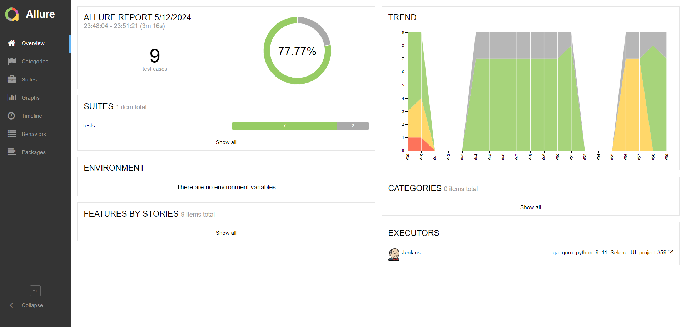

# Проект по тестированию сервиса мужских аксессуаров, украшений ручной работы, косметики и других подарков для мужчин.

----
> Магазин мужских подарков, аксессуаров и украшений

> [Сайт BORODA.LAND](https://boroda.land/)


----

## Список проверок, реализованных в автотестах:

### UI автотесты:

- [x] Проверка авторизации с валидными и не валидными данными
- [x] Регистрация пользователя на сайте 
- [x] Провека добавления и удаления товара из корзины
- [x] Провека добавления и удаления товара из избранного
- [x] Проверка поиска товара с помощью поисковой строки
- [x] Проверка выбора товара на главной странице каталога

----

### Проект реализован с использованием:

<p  align="left">
<code></code>
<code></code>
<code></code>
<code></code>
<code></code>
<code></code>
<code></code>
<code></code>
<code></code>  
<code></code>   
<code></code>  


> Для полноценного прохождения всех тестов должно быть  зарегистрировано два аккаунта. Данные
> которых необходимо указать в файле
`.env`
>
Для написания UI-тестов используется фреймворк `Selene`, современная «обёртка» вокруг `Selenium WebDriver`
Библиотека модульного тестирования: `PyTest`  
`Jenkins` выполняет удаленный запуск тестов в графическом интерфейсе. Установки дополнительных приложений на компьютер
пользователя не требуется.  
`Selenoid` запускает браузер с тестами в контейнерах `Docker` (и записывает видео)  
Фреймворк `Allure Report` собирает графический отчет о прохождении тестов  
После завершения тестов `Telegram Bot` отправляет в `Telegram` краткий вариант `Allure Report`

----

### Локальный запуск

Необходимо создать файл `.env` и заполнить его актуальными тестовыми параметрами.

1) Скачать проект и открыть в IDE
2) Для локального запуска необходимо выполнить команду в терминале:

```commandline
pytest
```

3) Выполнить запрос на формирование отчета  
   note: команда для Windows

```commandline
allure serve
```

Результат: откроется страница с отчетом Allure Report

----

###  Удаленный запуск автотестов выполняется на сервере Jenkins

> <a target="_blank" href="https://jenkins.autotests.cloud/job/qa_guru_python_9_11_Selene_UI_project/">Ссылка на проект в
> Jenkins</a>

----


#### Для запуска автотестов в Jenkins

1. Открыть <a target="_blank" href="https://jenkins.autotests.cloud/job/C10_MDN782007_autodoc_test_project/">проект</a>
2. Выбрать пункт `Build with Parameters`
3. Выбрать браузер
4. Выбрать версию браузера
4. Указать комментарий для уведомления в Телеграмм
5. Нажать кнопку `Build`
6. Результат запуска сборки можно посмотреть в отчёте Allure


----

###  Allure отчет


Отчет позволяет получить детальную информацию по все шагам тестов, включая скриншоты и log - файлы


###  Видео прохождения теста:

Видеозапись каждого теста генерируется с помощью `Selenoid` после успешного запуска контейнера c тестами в `Docker`.


###  Получение уведомлений о прохождении тестов в Telegram

После завершения сборки специальный Telegram-бот отправляет сообщение с отчетом.  


